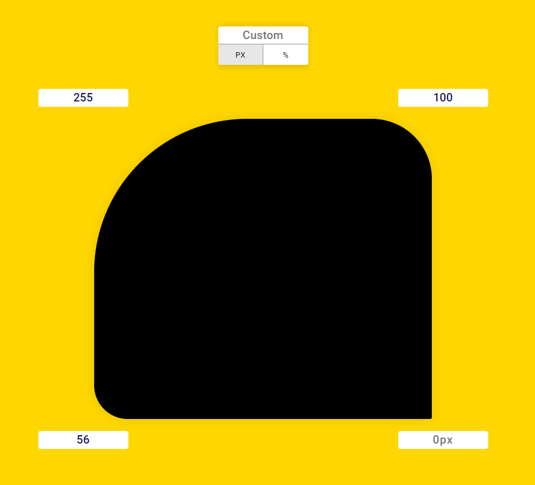

# border-previewer

A simple Border Radius that can be changed in real-time

###### All this coded by me!

## Technologies

##### HTML5, CSS3 and JavaScript

## Result

> #### See the result live [here](https://border-previewer.vercel.app/) 
> 
